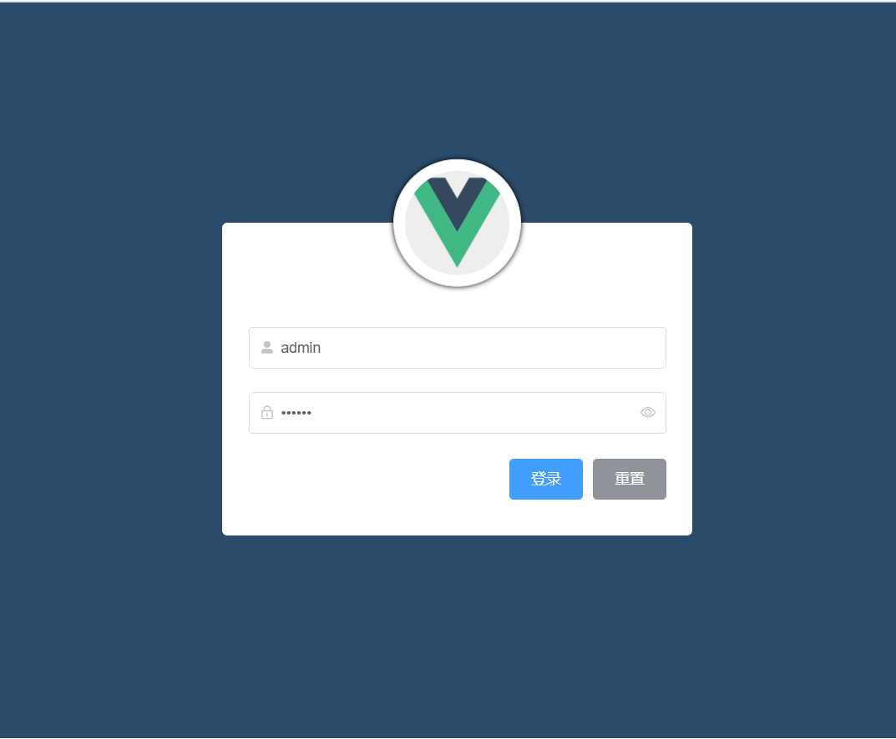

# 电商后台管理系统


## 一、项目概述

### 1.1 简介

- 前后端分离项目，实现了数据库的增删改查等功能

- 电商后台管理系统的**功能** 

    - 电商后台管理系统用于管理用户账号、商品分类、商品信息、订单、数据统计等业务功能。 

- 已部署至远程服务器，项目预览地址：http://www.timecrush.cn:8000

    

    


### 1.2 技术选型

- 前端：`Vue` `Vuex` `Vue-Router` `Element-UI` `JavaScript` `H5+C3` `axios` `Echarts`   `Vue-Cli`
- 后端 `Node` `express`  `jsonwebtoke`  `MySQL`  
- 测试 `postman`


### 1.3 目录结构说明


- *前端项目*目录结构说明

    


- 后端项目目录说明

    


## 二、运行项目

### 2.1 运行前端项目

1. 在`client`文件夹中，执行`npm i `命令，下载前端项目所依赖的第三方包
2. 执行`npm run serve`命令，运行基于**Vue-Cli脚手架创建的前端项目**

3. 登录账号：admin  登录密码：123456


- 关于前端发送的网络请求接口说明：
    - 在`network -> request.js `中，如果接口是远程地址的，则可以不用配置后端环境


### 2.2 后端环境配置

- **后端项目已部署至远程服务器**
    - 接口地址：http://www.timecrush.cn:8888/api/private/v1/
    - 如果直接使用**远程接口**地址发送请求，那么可以**忽略以下配置步骤**


1. 开启MySQL服务，将`server`文件夹下的`db`文件夹下的`mydb.sql`文件运行，导入基本数据表


2. 在`server文件夹  -> config文件夹 -> default.json`中修改MySQL的基本配置


3. 安装Node环境

4. 在`server文件夹`中打开终端命令行窗口，执行`npm i `命令，安装依赖包

5. 运行后端项目

    - 在`server文件夹`中通过Node环境，运行app.js文件，命令`node app.js`，如果不报错并且显示数据库数据，则说明启动成功

        


6. 使用 **Postman** 测试后台项目接口是否正常 

    - 测试是否能够请求到数据

    


## 三、功能实现

### 3.1 登录




- 登录业务流程 
       ① 在登录页面输入用户名和密码 

       ② 调用**后台接口**进行验证 
    
       ③ 通过验证之后，根据后台的**响应状态**跳转到项目主页 


- 代码实现流程
    1. 配置登录页面的前端路由  （Vue-Router）
    2. 绘制登录表单区域   （Elemet UI）
    3. 发送网络请求，验证登录 (Axios)
    4. 将服务器返回的token存储到本地缓存中
    5. 跳转到主页对应的前端路由


### 3.2 主页


1. 整体布局  (Element UI ---- container容器)

2. 左侧菜单栏静态渲染  （el-aside）
3. 左侧菜单栏动态渲染   (axios获取数据)
4. 为每一个菜单栏动态绑定要跳转到的前端路由 （Element UI）


### 3.3 增删改查


### 3.4 表单验证


- 代码实现

    - Element UI 提供的`el-form`组件，带有表单验证功能

        


### 3.5 网络请求封装

- 基于axios库的二次网络请求封装

    


### 3.6 组件的抽离

- 将主页中的**头部**、**侧边栏**、**右侧主体区域**的具体代码，抽离到子组件中，增加代码的**可维护性**

- 在views -> home文件夹中新建一个`childHome`文件夹，该文件夹用于存放**Home.vue组件相关的子组件**

    - ```
        ├── views
        │   ├── home
        │   	└── childHome
        |   	└── Home.vue
        ```

        

        

        

        


### 3.7 Nginx部署项目

1. 执行`npm run serve`命令，对Vue项目进行打包

2. 将打包后的dist文件夹存放在`nginx`根目录下

    

    

    

3. 更改nginx端口号，以及文件访问路径


4. 双击启动Nginx服务，打开浏览器，访问`localhost:8077`，如果出现以下界面则部署成功

    


